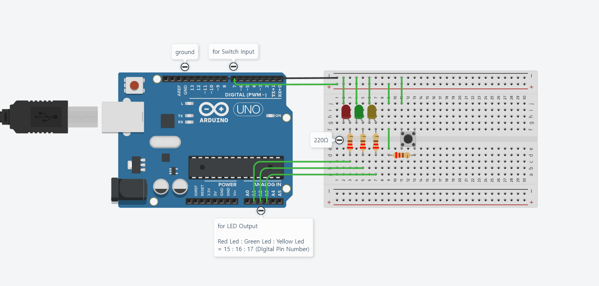

# IMU vs Vision

## This gif shows Project Prototype! using 1 IMU Sensor.

<p align="center">
  <br>
  Title : <b>IMU Sensor</b> versus <b>Vision Algorithm</b> for Hands-Gesture Recognition
</p>


## Implementation

- Arduino Nano, Arduino Uno
- Raspberrt Pi 4B
- IMU, LED Dot Matrix, Webcam

## IMU Part

- IMU Pre-processing


- IMU Data Annotation


<!--
## Examples

```ino
digitalWrite(RED_PIN, HIGH);

// detect button input
if (digitalRead(BUTTON) == LOW){ status = 1; }

// main code to mimics a 'traffic light'
if (status == 1){
  // turn on green led during 1s
  turn_off(LED_PIN_SET);
  digitalWrite(GREEN_PIN, HIGH); }
```

<p align="center">
  
</p>
/--> 
